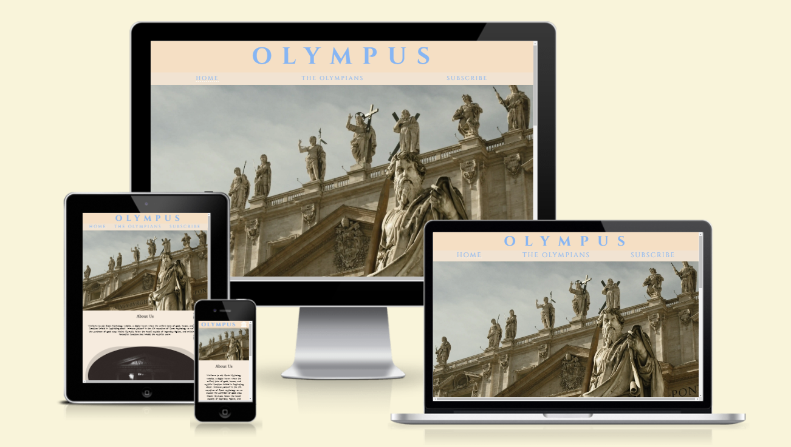
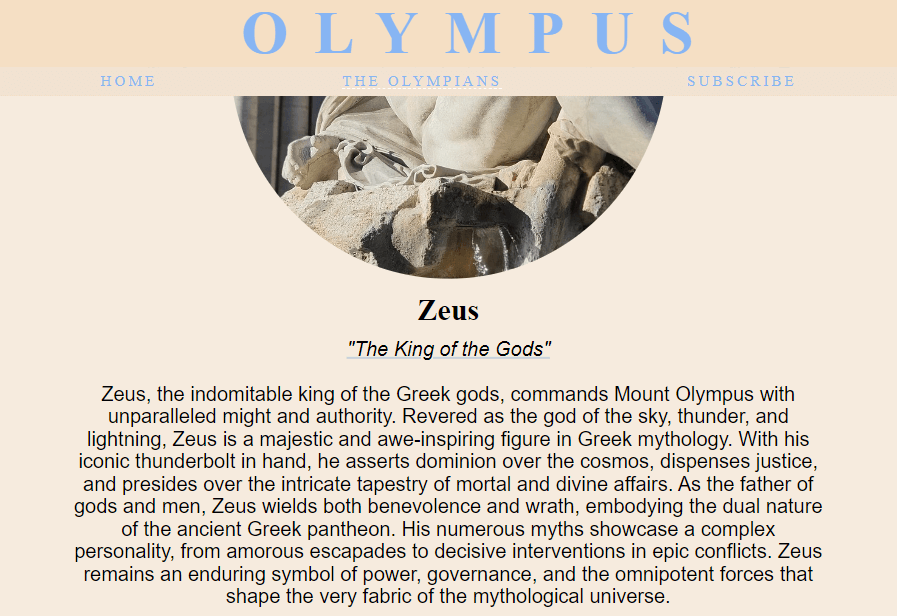
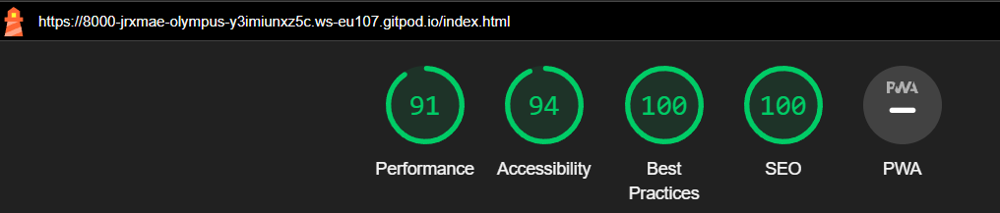
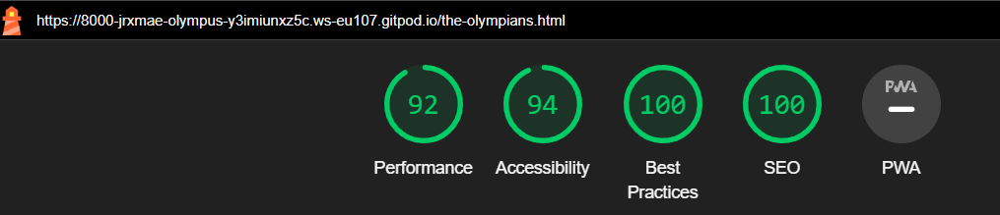

# OLYMPUS

Olympus is a place where people, who enjoy reading about the adventures of Greek gods and goddesses, can learn of new stories or relive them. We hope to expand the interest of all ages into the vast world of Ancient Greek mythology . You can start your journey with us [here](https://jrxmae.github.io/olympus/).

## Table of Contents

1. [User Experience (UX)](#user-experience-ux)
    1. [Project Goals](#project-goals)
    2. [User Stories](#user-stories)
    3. [Color Scheme](#color-scheme)
    4. [Typography](#typography)
2. [Features](#features)
    1. [General](#general)
    2. [Home Page](#home-page)
    3. ['The Olympians' Page](#olympians-page)
    4. [Subscribe Page](#subscribe-page)
3. [Technologies Used](#technologies-used)
    1. [Languages Used](#languages-used)
    2. [Frameworks, Libraries and Programs Used](#frameworks-libraries-and-programs-used)
4. [Testing](#testing)
    1. [Testing User Stories](#testing-user-stories)
    2. [Code Validation](#code-validation)
    3. [Accessibility](#accessibility)
    4. [Tools Testing](#tools-testing)
    5. [Manual Testing](#manual-testing)
5. [Finished Product](#finished-product)
6. [Deployment](#deployment)
    1. [GitHub Pages](#github-pages)
7. [Credits](#credits)
    1. [Content](#content)
    2. [Media](#media)
    3. [Code](#code)
8. [Acknowledgements](#acknowledgements)

***

## User Experience (UX)

### Project Goals

* Present a website reminiscent of an ancient Greek temple to emit the feeling of travelling through history.

* Offer alternative options for the user to gain information such as a video if they are unable to read.

* Provide the user with concise information as too much text will be overwhelming.

### User Stories

* A user should be able to easily navigate the website.

* A user should be able to read and understand clearly what is written.

* A user should be able to contact the website in some way.

* A user should be able to choose between different options when filling out the form.

* A user should be able to visit the social media pages of the website, providing they have one.

### Color Scheme

The main colors in this website are shades of beige and blue with off-white used for icons, dark grey for contrast and black for hover and text.

### Typography

The main font is 'GFS Neohellenic' with Sans-Serif as fallback. 'Cinzel' is used in the header and navigation bar with Serif as fallback. Lastly, 'GFS Didot' is used in heading of the main content with Serif as fallback.

[Back to top ⇧](#olympus)

## Features

### General

* A cohesive theme: brought together by the colors used and the typography

* A responsive website across all different sizes and types of devices

* **Header**

    - The header contains the name of the website, 'Olympus' which also acts as a link to the home page.

    - The navigation bar is spread out horizontally in larger devices, but becomes a dropdown navigation bar for tablet and mobile devices.

    - The header and navigation turn black when hovered over by the user and a white dashed line shows underneath the current page.

* **Footer**

    - The footer is where you can find the website's social media links.

### Home Page

* **Hero Image**

    - The hero image welcomes the user, using the statues in the image to depict the gods and goddesses welcoming them.

* **About Us**

    - The 'About Us' section informs the user of the goal of the website and what they may find.

* **Contact Us**

    - The 'Contact Us' section provides the user with an email and phone they can contact for technical problems and/or questions.

### 'The Olympians' Page

* **Zeus Section**

    - There is an image of the statue of Zeus with his name and title underneath as 'King of the Gods', then a paragraph about who he is.

* **Poseidon Section**

    - There is an image of Poseidon's statue(left) with his name and title underneath as 'God of the Sea', then a paragraph about who he is.

* **Hades Section**

    - There is an image of Hades' statue with his name and title underneath as 'God of the Underworld', then a paragraph about who he is.

### Subscribe Page

* **Video Section**

    - There is a video provided that the user can watch if they wish to learn more about other gods that is not currently available on the website.

* **Subscribe Form**

    - The form is a newsletter that users can subscribe to if they wish to be informed when new content is added to the website, which they can choose how to be contacted.

[Back to the top ⇧](#olympus)

## Technologies Used

### Languages Used
* [HTML5](https://en.wikipedia.org/wiki/HTML5)
* [CSS3](https://en.wikipedia.org/wiki/CSS)

### Frameworks, Libraries and Programs Used

* [GitHub](https://github.com/)
    - GitHub is where the repository was created and where all commits were pushed to.

* [GitPod](https://gitpod.io/)
    - GitPod was used to write, edit, test and commit the code.

* [Chrome DevTools](https://developer.chrome.com/docs/devtools/)
    - Chrome DevTools was used to test the responsiveness, test different styling and do a performance check using lighthouse.

* [Google Fonts](https://fonts.google.com/)
    - Google Fonts was used to import the fonts 'Cinzel', 'GFS Neohellenic and 'GFS Didot', to suit the theme of the website.

* [Font Awesome](https://fontawesome.com/)
    - Font Awesome was used to allow for the addition of icons used in the contact section.

* [W3C Markup Validator](https://validator.w3.org/)
    - W3C Markup Validator was used to validate the HTML code.

* [W3C CSS Validator](https://jigsaw.w3.org/css-validator/)
    - W3C CSS Validator was used to validate the CSS code.

* [TinyPNG](https://tinypng.com/)
    - TinyPNG was used to compress the images for better optimization.

* [CloudConvert](https://cloudconvert.com/)
    - CloudConvert was used to convert .jpeg files to .webmp for better performance on the website.

* [Am I Responsive?](https://ui.dev/amiresponsive)
    - Am I Responsive? was used to check the responsive design through Apple devices using mock up images.

* [CSS Scan](https://getcssscan.com/css-buttons-examples)
    - CSS Scan was used to style the submit button on the form as suggested by my mentor.

* [Icons8](https://icons8.com/icons)
    - Icons8 was used to download the favicon image sizes.

* [FavIcon](https://favicon.io/favicon-converter/)
    - FavIcon converter was used to convert the favicon images into a zip file that contains sizes not readily available on Icons8.

[Back to the top ⇧](#olympus)

## Testing

### Testing User Stories

* A user should be able to easily navigate the website.

    - With smaller screen sizes, the website offers a dropdown menu to accommodate the space. When the screen is larger, the menu spreads out to fill the screen space.

    - The current active page will be underlined in white, a different color to the text so as not to confuse the user.

* A user should be able to read and understand clearly what is written.

    - The text is in black to stand out against the light background color, the size readjusts depending on the screen size and the font used is clear.

* A user should be able to contact the website in some way.

    - There is a 'Contact Us' provided in the home page where they can find an email and a phone number. 

* A user should be able to choose between different options when filling out the form.

    - In the form section, the user can choose to their preferred way of receiving the newsletter.

* A user should be able to visit the social media pages of the website, providing they have one.

    - At the bottom of the page, on the footer, there are four icons provided with links to their corresponding social media website.

    - The user can choose where to follow the website and each link opens in a new tab, not hidering their browsing of this website.

### Validator Testing

* The [W3C Markup Validator](https://validator.w3.org/) was used to check the .html pages for any errors.

    - In the first validator check of the 'Subscribe' page, the W3C Markup Validator found an error with the input tags inside the form. There was an error with the id, this was fixed by putting the input tags inside the label tags as the id was not needed.

* The [W3C CSS Validator](https://jigsaw.w3.org/css-validator/) was used to check the .css file for any errors.

    - The W3C CSS Validator found no errors and 4 warning in my CSS, warnings that involve styling used from outside sources such as [CSS Scan](https://getcssscan.com/css-buttons-examples)

### Accessibility

* Lighthouse in Chrome DevTools was used to test the performance of the website.

* Results:

    - **Home Page**
    

    - **'The Olympians' Page**
    

    - **Subscribe Page**
    

### Tools Testing

* [Chrome DevTools](https://developer.chrome.com/docs/devtools)

    - Chrome DevTools was used to test the code being applied, responsiveness to different screen sizes and performance.

* [Am I Responsive?](https://ui.dev/amiresponsive)

    - Am I Responsive? was used to test the responsiveness of the website with Apple products provided in the mockup images.

### Manual Testing

* Browser Compatibility

    - This website has been tested on the browsers below:

        - **Google Chrome**
        No issues to be seen.

        - **Safari**
        No issues to be seen on mobile version. Physical larger screen sizes not tested, checks made through Chrome DevTools.

        - **Mozilla Firefox**
        No issues to be seen.

        - **Microsoft Edge**
        No issues to be seen.

        - **Opera GX**
        No issues to be seen.

* Device compatibility

    - The website has been tested on the devices below:

        - **Samsung Galaxy S23 Ultra**
        No issues to be seen.

        - **iPhone 14 Pro**
        No issues to be seen.

        - **Samsung Galaxy Tab S9 FE 10.9"**
        No issues to be seen.

        - **Acer Nitro 5**
        No issues to be seen.
    
* Common Elements Testing

    - All Pages

        - **Header**

            - Clicking on the header logo will bring the user back to the home page.

            - Hovering over header logo changes text to black.

        - **Navigation Bar**

            - A white, dashed line appears underneath current active page.

            - Hovering over navigation bar link turns text to black.

        - **Footer**

            - Each social media icon will open the linked website in a new tab when clicked.
    
    - Subscribe Page

        - Controls are immediately visible and the video is automatically muted.

        - If any of the 'First Name', 'Email Address' and 'Phone Number' fields are left empty, the user will be warned that they are required before submitting.

        - The user is required to choose one of the radio buttons of 'Email' or 'Phone' depending on their preference of contact.

[Back to the top ⇧](#olympus)

## Finished Product

[Back to the top ⇧](#olympus)

## Deployment

* [GitPod](https://www.gitpod.io/) was used to develop the website where all commits were made then pushed to GitHub.

### GitHub Pages

* Below are the steps used to deploy this website to GitHub:

    1. From your GitHub dashboard page, find and select the repository you wish to deploy.

    2. Once you're in said repository, head to settings at the end of the many menu tabs.

    3. When you're in the settings, locate the 'Pages' section.
    
    4. Find 'Source' and make sure you have 'Deploy from a branch' selected. Underneath 'Branch', make sure to change from 'none' to 'main' and that it is set to '/root' beside it.

    5. Head back to the 'Code' from the menu tabs and after a few minutes, a link to your website should generate on the top of that page.

[Back to the top ⇧](#olympus)

## Credits

### Content

* [ChatGPT](https://chat.openai.com/)

    - ChatGPT was used to write the 'About Us' section and each paragraph in 'The Olympians' page.

* [Pura Vida Spa](https://github.com/josswe26/pura-vida-spa)

    - This sample project was a guide for the template of the'ReadMe' file.

* [Code Institute](https://github.com/Code-Institute-Solutions/readme-template)

    - Code Institue also helped guide as a template of the 'ReadMe' file.

- The rest of the texts was written by the developer.

### Media 

* [Pixabay](https://pixabay.com/)

    - Zeus image: Taken by RobertoSFR
    - Poseidon image: Taken by jhenning
    - Form background image: Taken by 2102033

* [Unsplash](https://unsplash.com/)

    - Hero image: Taken by Nils
    - Contact Us image: Taken by Miltiadis Fragkidis
    - Hades image: Taken by Unma Desai

* [YouTube](https://youtube.com/)

    - Video on 'Subscribe' page: 'The 12 Olympians: The Gods and Goddesses of Ancient Greek Mythology' by World History Encyclopedia.

* [Icons8](https://icons8.com/icons/set/temple)
    - Favicon on title : Image sizes provided by [Icons8](https://icons8.com/icons/set/temple), converted to a favicon zip file by [CSS Scan](https://getcssscan.com/css-buttons-examples).

### Code

* [Code Institute](https://codeinstitute.net/ie/) 

* [Stack Overflow](https://stackoverflow.com/) and [W3Schools](https://www.w3schools.com/) were used to better understand what I was applying to my code and helped me understand why my code wasn't working at times. I was able to explore and learn the many options available for the elements I was using.

* [Pura Vida Spa](https://github.com/josswe26/pura-vida-spa) is a sample project my mentor sent me, which helped guide with the 'ReadMe' file as well as design.

[Back to the top ⇧](#olympus)

## Acknowledgements

* Very grateful to my mentor Marcel for his guidance, helpful feedback and always easing my worries.

* Thank you to my friends and family for their support and patience with my questions.

* Greatly appreciate Code Institute and the Slack community for the concise lessons and helpful community.

[Back to the top ⇧](#olympus)